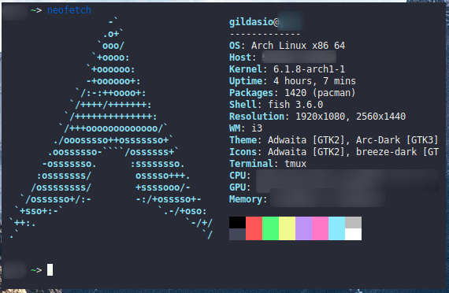

# Dracula for [st](http://st.suckless.org/)

> A dark theme for [st](http://st.suckless.org/), the Suckless Terminal.

## Install

All instructions can be found at [draculatheme.com/st](https://draculatheme.com/st).

## Team

This theme is maintained by the following person(s) and a bunch of [awesome contributors](https://github.com/dracula/st/graphs/contributors).

|  |  |
| ---------------------------------------------------------------------------------------- | ------------------------------------------------------------------------------------------  |
| [Zeno Rocha](https://github.com/zenorocha)                                               | [Gildásio Júnior](https://github.com/gildasio)                                              |

## Community

- [Twitter](https://twitter.com/draculatheme) - Best for getting updates about themes and new stuff.
- [GitHub](https://github.com/dracula/dracula-theme/discussions) - Best for asking questions and discussing issues.
- [Discord](https://draculatheme.com/discord-invite) - Best for hanging out with the community.

## License

[MIT License](./LICENSE)
